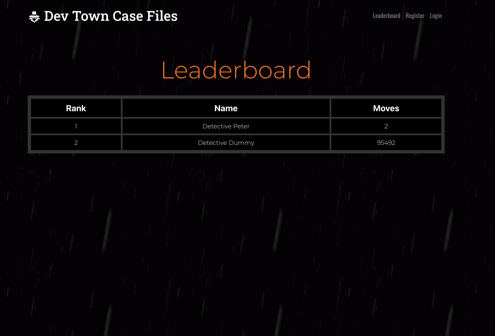

# Dev Town Case Files - Murder Mystery Game

Welcome to the Dev Town Case Files, a murder mystery game created by the following team members: Tony Vu, Kenny Pham, and Santiago. This game challenges you to solve the murder of McKenna and the abduction of Toni, twin sisters. This README will provide an overview of the project, its features, and how to use it.

# Video Overview 

https://www.youtube.com/watch?v=VDw1FP9GRYE&ab_channel=Santiago

## Table of Contents
1. Project Description
2. Technologies Used
3. Registration / Login
4. Features
5. Leaderboard
6. Game Over

## Project Description
The Dev Town Case Files is a React-based murder mystery game created by the team of Tony Vu, Kenny Pham, and Santiago. This game allows players to investigate and solve the murder of McKenna and the abduction of Toni, twin sisters. The game includes user registration and login functionality, a session display, and four main tabs for exploring various clues related to the mystery.

## Technologies Used

* React.js: The project is built using the React.js library for creating a dynamic user interface.
* Bootstrap: Bootstrap is used for creating responsive and visually appealing UI components.
* TypeAnimation: TypeAnimation is used for dynamic and animated text within the game.
* React-Bootstrap: React-Bootstrap is utilized for incorporating Bootstrap components into the React application.
* PostgreSQL: PostgreSQL is used to store the game's database, including user information and game progress.
* React Router DOM: React Router DOM is used for managing navigation and routing within the application.
* Flexbox: Flexbox is used for creating flexible and responsive layouts.
* Modals: Modals are implemented to display additional information and clues in a user-friendly manner.

## Registration / Login
Register or log in to access the game.
Explore the four tabs (Characters, Newspaper, Alibis, and Photo Gallery) to gather clues and information.
Piece together the evidence to solve the murder and abduction case.

### Features
- User Authentication
Users can register and log in to access the game.
Once logged in, the user's name is displayed in the top right corner of the interface.

# Clues Tabs

## Characters Tab

- This tab provides information about the characters in the game, which may be crucial to solving the mystery.

## Newspaper Tab

- Here, players can find extra information about the murder of McKenna and the abduction of Toni. This tab may contain essential details for solving the case.

## Alibis Tab
- The Alibis tab presents alibi information for all the characters in the game, helping players determine their potential involvement in the case.

## Photo Gallery Tab

- The Photo Gallery displays images that can assist players in finding more clues for the mystery. These images may contain hidden hints or key information.

## Solving the Mystery
To progress through the story and solve the mystery, players need to interact with the clues presented in the tabs.
Correctly answering questions or piecing together the evidence will allow the storyline to continue.

## Difficulty Progression
As you get further into the story, the difficulty will increase.
You'll need to look deeper and retain information to solve the case.

## Leaderboard
Upon completing the mystery, you'll have the option to add your name to the leaderboard.
The leaderboard will calculate how many moves it took for you to solve the mystery.
Your ranking will be based on the moves you make, ranging from master detective to the worst detective.

## Timer
The game includes a timer to add pressure to find the mystery's solution.
The killer will also be hunting you, and once the timer runs out, you'll be transferred to a game over screen.
The game over screen will inform you that the killer has found you, and you'll have the option to click "Play Again."

